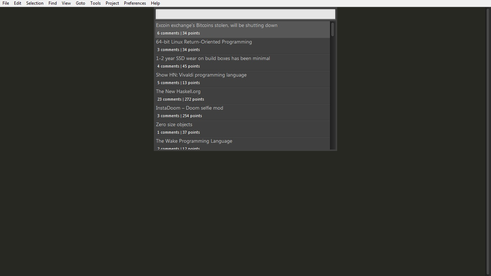
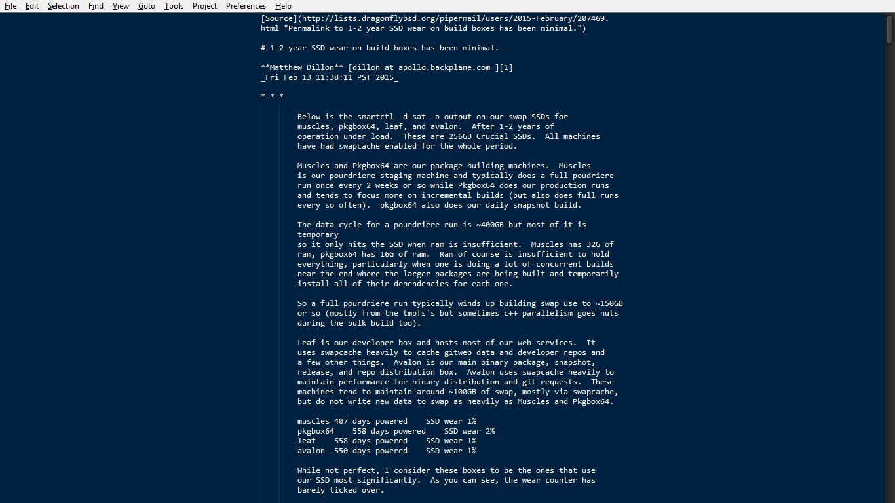

# sublime-hackernews

- A sublime text plugin to read Hacker News articles from within the editor.
- Uses the [cheeaun's unofficial Hacker News API](https://github.com/cheeaun/node-hnapi) and [FUCK YEAH MARKDOWN](http://fuckyeahmarkdown.com/) for rendering HTML articles as text.
- Inspired from [vim-hackernews](https://github.com/ryanss/vim-hackernews).

# Screenshots

## Usage

- Press ctrl+alt+n from the sublime text window and the rest follows.
- Press ctrl+alt+c while on the article window to open comments for that article

## Configuring

- Goto Preferences -> Package Settings -> sublime-hackernews -> Settings-Default.
- Change http_proxy and theme settings as per your requirements and save.